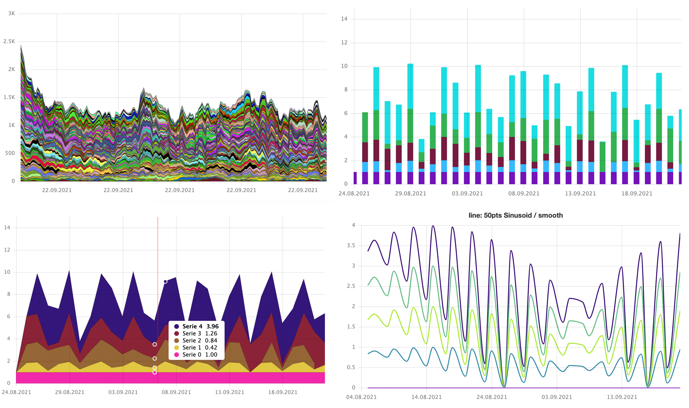

# Ẏagr 

Yagr is a high-performance HTML5 canvas chart renderer based on [uPlot](https://github.com/leeoniya/uPlot). It provides high-level features for uPlot charts.

## Features

-   [Lines, areas, columns, and dots as visualization types. Configurable per series](https://yagr.tech/en/api/visualization)
-   [Configurable Legend Tooltip](https://yagr.tech/en/plugins/tooltip)
-   [Axes with extra options for decimal-level precision](https://yagr.tech/en/api/axes)
-   [Scales with configurable range functions and transformations](https://yagr.tech/en/api/scales)
-   [Plot lines and bands. Configurable draw layer](https://yagr.tech/en/plugins/plot-lines)
-   [Responsive charts](https://yagr.tech/en/api/settings#adaptivity) (requires [ResizeObserver](https://developer.mozilla.org/en-US/docs/Web/API/ResizeObserver))
-   [High-level support of stacked areas/columns](https://yagr.tech/en/api/scales#stacking)
-   [Configurable markers](./docs/api/markers.md)
-   [Light/Dark theme](https://yagr.tech/en/api/settings#theme)
-   [Data normalization](https://yagr.tech/en/api/scales#normalization)
-   [Configurable crosshairs, cursor markers and snapping](https://yagr.tech/en/api/cursor)
-   Typescript
-   [Localization](https://yagr.tech/en/api/settings#localization)
-   [CSS Variables in color names](https://yagr.tech/en/api/css)
-   [Paginated inline legend](https://yagr.tech/en/plugins/legend)
-   [Error handling and extended hooks](https://yagr.tech/en/api/lifecycle)
-   [Data alignment and interpolation for missing data](https://yagr.tech/en/api/data-processing)

## [Documentation](https://yagr.tech)
