# Yagr

Yagr is a high level library for rendering HTML5 Canvas charts based on extra-fast library [uPlot](https://github.com/leeoniya/uPlot).

## Why Yagr?

Why not use uPlot directly? uPlot is very flexible library and it provides amazing API to create your own plugins and implement different visualizations, but uPlot is too low level library. If you need a lot of common chart [features](#features) such as [legend tooltip](#tooltip), [stacking](#stacking), [normalization](#normalization) etc then you should implement them by yourself if you choose uPlot. Yagr already have implented much of that features. Yagr pretty much configurable and you can extend it or customize view and behavior, and also allows to extend uPlot object directly.

## Why not Yagr

If you doesn't need Yagr features but need something specific which is not implemented in Yagr then you should use uPlot directly or welcome to the issues(#@TODO). Otherwise, I recommend to use Yagr and try to extend it, feel free to ask questions and bring you ideas into our [Issues Page](#@TODO).

### Features

-   [Lines, Areas, Columns, Dots as visualization type. Configurable per series](#visualization-types)
-   [Configurable Legend Tooltip](#tooltip)
-   [Axes with extra options for decimals precision](#axes)
-   [Scales with configurable range functions and transformations](#scales)
-   [Plot lines and bands. Configurable draw layer](#plot-lines)
-   [Responsive charts](#settings.adaptive) (requires [ResizeObserver](https://developer.mozilla.org/en-US/docs/Web/API/ResizeObserver))
-   High level support of stacked areas/columns
-   [Light/Dark theme](#settings.theme)
-   [Data normalization](#scale.normalize)
-   [Configurable crosshairs, cursor markers and snapping](#cursor)
-   Typescript
-   [Localization](#localization)
-   [CSS Variables in color names](#css)
-   [Paginated inline legend](#legend)
-   Error handling and extended hooks
-   [Data alignment and interpolation for missing data](#data-alignment)

## Quick start

### Install

```
npm install yagr
```

### Integration

By default Yagr exposed ES2017 module for TypeScript but you can import different modules:

-   `yagr/dist/yagr.es5.js` - ES5 module
-   `yagr/dist/yagr.umd.js` - UMD module
-   `yagr/dist/yagr.iife.js` - IIFE module

### Run

Let's see a minimal valid chart's config:

```ts
import Yagr from 'yagr';

const config = {
    timeline: [0, 1000, 2000],
    series: [
        {data: [1, 2, 3], color: 'red'},
        {data: [2, 4, 1], color: 'green'},
    ],
};

const y = new Yagr(document.body, config);
```

Yagr will render simple line chart with two lines:


By default Yagr turns on some plugins such as tooltip and axes formating, details of default behavior you can see in plugins section. See [documentation](#documentation) for configuration.

To undestand Yagr you should know about some restrictions of implementations:

-   all series should be aligned on single timeline. This restriction can cause some alignment artifacts when you have different data sources which timestamps doesn't match each other. See [data alignment section](#data-alignment) to undestand how to handle such cases.
-   you should or define chart size in config, or use `settings.adaptive: true` and define size of chart's root HTML element by CSS.

## Lifecycle stages

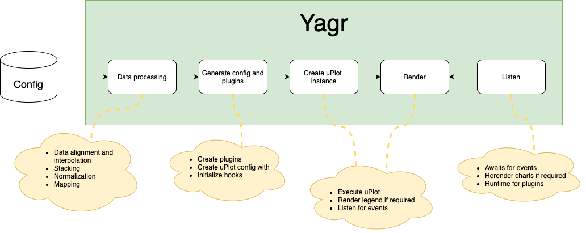

Yagr has 4 stages:

-   **Processing** - on this stage yagr makes all data transformation if required: data alignment with interpolation, stacking, normalization, caches everything which will be useful later and prepares to create uPlot config.
-   **Generate config and plugins** - initialize and configure plugins, parse CSS-colors, preparing default settings for scales, axes, register default hooks, finally creates config and data series for uPlot.
-   **Create uPlot instance** - creates uPlot instance.
-   **Render** - renders node with custom renderer, also render legend if required.
-   **Listen** - yagr instance awaits for events, triggers hooks, rerenders chart and

When yagr instance is removing `yagr.dispose()` should be called to dispose all handlers and event listeners of chart instance.

## React

Yagr exports default React wrapper. You can import it as:

```ts

import {YagrConfig} from 'yagr/react';
import YagrComponent from 'yagr/react';

...
function App({config}: {config: YagrConfig}) {
    return <YagrComponent config={config} />;
}
```

## Documentation

### Visualization types

Yagr support 4 timeseries vizualization types:

-   `'line'`

    

-   `'area'`

    

-   `'dots'`

    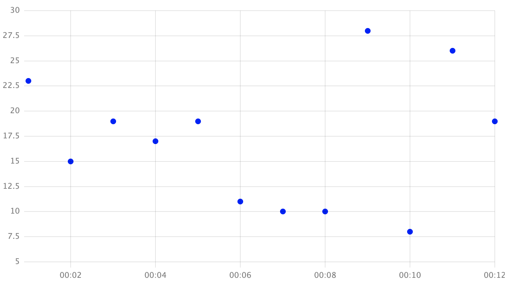

-   `'column'`

    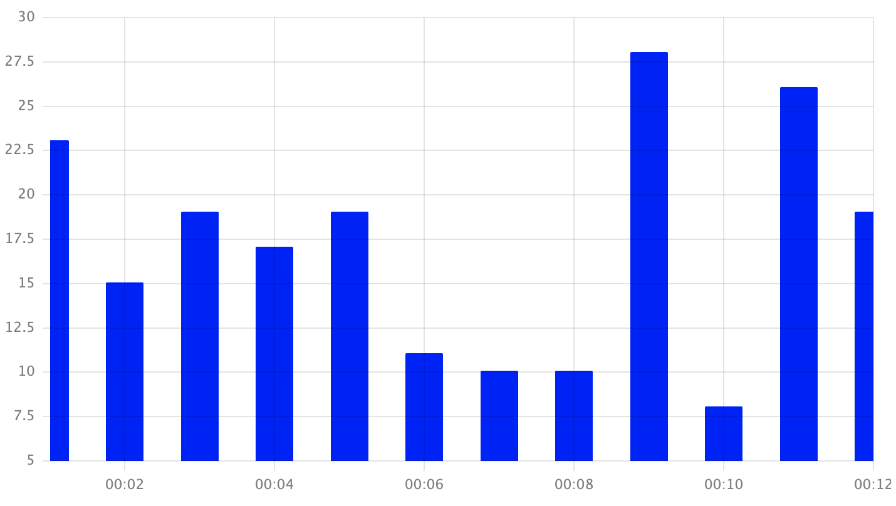

You can configure chart type for whole chart:

```js
chart: {
    type: 'line';
}
```

or per series

```js
chart: {
    type: 'line'
},
series: [
    {data: [2, 4, 1], color: 'green'},             // will render line (by default in chart.type)
    {data: [1, 2, 3], color: 'red', type: 'area'}, // will render area
]
```

Keep in mind that Yagr draws first series from the last one to the first, so if you render non-transparent area at first, it can overlap other series. Be careful.

### Scales

Scales is a key-value object, where keys are scale names and values scale configs.

```js
scales: {
    y: {
        type: 'linear',
        min: 0,
    }
}
```

#### scale.type

-   `'linear'` - linear scale
-   `'logarithmic'` - logarithmic scale (log<sub>10</sub>)

#### scale.normalize: boolean

If true, then normalize all scale's series data to given base (100% by default)

#### scale.normalizeBase: number

Base of normalization

#### scale.min: number

Minimum of scale

#### scale.max: number

Maximum of scale

#### scale.range:

-   `'nice'` - implementation of NiceScale with extra features to make charts nice for stacked areas
-   `'offset'` - static offset from data min and max
-   `(u: uPlot, min: number, max: number, ref: RefPoints | undefined, cfg: YagrConfig) => [min: number, max: number]` - custom function

#### scale.maxTicks: number

Count of max ticks for `scale.range = 'nice'`.

#### scale.offset: number

Value of offset for `scale.range = 'offset'`.

#### scale.minRange: number

Minimal value of scale range between min and max. Use for stabilize nice-scale with different base of scales.

#### scale.stacking: boolean

Should stack values on given scale. False by default.

#### scale.transform

```ts
transform?: (v: number | null, series: DataSeries[], idx: number) => number;
```

Funtion to transform all values on given scale.

### Axes

Axes is key-value object, where keys are axis names (one-to-one with scales) and values axes configs. Axis config has type `AxisOptions` which extends uPlot `Axis`. See [axes config in uPlot](https://github.com/leeoniya/uPlot/blob/c58561b91bb47e74f00ce43760c3edf988557e2e/dist/uPlot.d.ts#L904).

Example:

```js
axes: {
    y: {
        precision: 3,
    }
}
```

#### axes.precision

-   `number`
-   `'auto'`

Precision for axis ticks.

#### axes.plotlines: PlotLineConfig[];

See [Plot Lines plugin](#plot-lines).

#### axes.side: 'top' | 'right' | 'bottom' | 'left'

Position of axis. `'left'` by default.

### Plot Lines

Plot Lines plugin allows to render custom lines on bands over the chart:

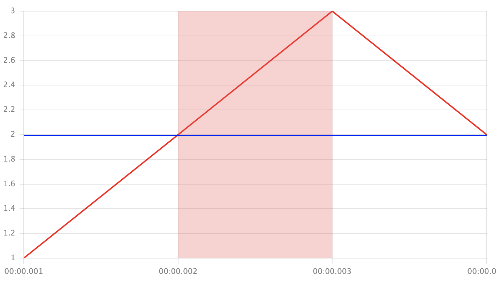

Plotlines are binded to axes which are binded to scales, so to render plotline you should pass it's config to given axis:

```js
// Render vertical band on X axis from X=Now-1s to X=Now
axes: {
    x: {
        plotLines: [{
            value: [Date.now() - 1000, Date.now()],
            color: 'rgba(255, 0, 0, 0.5)',
        }],
    },
}
```

or

```js
// Render blue horizontal line in width 2px, on the Y=2
axes: {
    y: {
        plotLines: [{
            value: 2,
            color: 'blue',
            width: 2 * devicePixelRatio
        }],
    },
}
```

By default plotlines drawing over the series and axes, you can choose draw layer in [settings.drawOrder](#settings.drawOrder)

#### Plot line config

```ts
export interface PlotLineConfig {
    /** Value of plotLine or [from, to] on given scale */
    value: number | [number, number];

    /** Color of line */
    color: string;

    /** Line width in px/devicePixelRatio */
    width?: number;
}
```

### Cursor

Yagr allows to setup chart's cursor behavior. You can configure crosshairs, markers size and count, and snapping behavior.

#### cursor.snapToValues?: SnapToValue | false

```ts
type SnapToValue = 'left' | 'right' | 'closest';
```

Snap to values allows to render markers only on existing points on timeline. If cursor points to value X value on which Y has null with `snapToValues` you can configure which real point to highligh with marker.

-   `'left'` - finds nearest non-null value to the left

    

-   `'right'` - finds nearest non-null value to the right

    

-   `'closest'` - finds nearest non-null

-   `false` - doesn't snaping to non-null values

    

#### cursor.markersSize?: number

Radius of markers

#### cursor.maxMarkers?: number

Maximal count of markers. If count of lines > `maxMarkers`, then markers don't drawing.

#### Crosshairs

You can set X and Y crosshairs in cursor options:

```js
cursor: {
    x: {visible: true, style: '1px solid red'},
    y: {visible: true, style: '1px dash grey'},
},
```

### Tooltip

Yagr has default legend tooltip. You can easy implement your own renderer.
Most of tooltip options are typeof `PerScale`, which means that it could be `value` or `{scale: value}`. You can see example of multi-scale tooltip on picture:

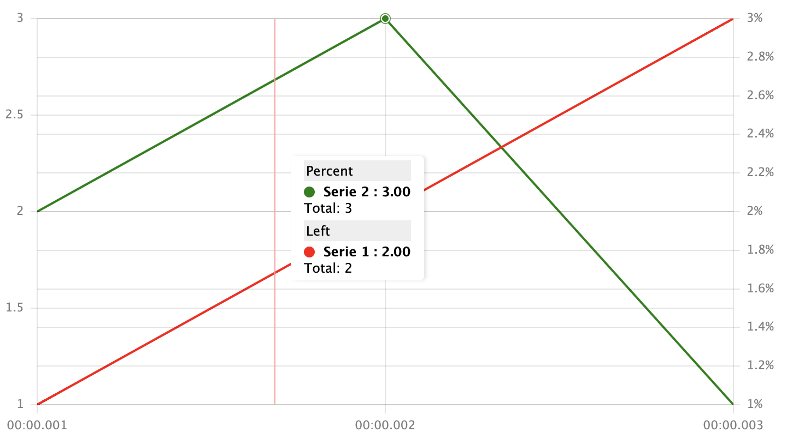

Configuration for this example:

```js
{
    timeline: [1, 2, 3],
    series: [
        {
            data: [1, 2, 3],
            color: 'red',
        },
        {
            data: [2, 3, 1],
            scale: 'percent',
            color: 'green',
        },
    ],
    tooltip: {
        scales: {
            y: 'Left',
            percent: 'Percent',
        },
    },
    axes: {
        y: {},
        percent: {
            side: 'right',
            values: (u, x) => x.map(i => i + '%'),
        },
    },
    scales: {
        y: {},
        percent: {},
    },
};
```

#### tooltip.enabled: boolean

#### tooltip.maxLines: PerScale<number>

Max count of lines in tooltip.

### tooltip.sum: PerScale<boolean>

Should show sum row in tooltip.

#### tooltip.tracking

Tracking is a function which calculates active line index. Available next options:

-   `'sticky'` - finds closest line index
-   `'area'` - finds overlaped by cursor area's index
-   `(y: number, ranges: (number | null | string)[]) => number | null` - custom function which gives cursor Y value and list of Y values of lines. Should return active line index or null

#### tooltip.highlight: PerScale<boolean>

Should highlight active line in tooltip.

#### tooltip.sort?: PerScale<SortFn>

```ts
type SortFn = ((s1: TooltipRow, s2: TooltipRow) => number) | undefined;
```

Rows comparator function.

#### tooltip.render: (data: TooltipRenderOptions) => string

Tooltip renderer. See [TooltipRenderOptions](#@TODO)

#### tooltip.pinable: boolean

Is tooltip pinable.

#### tooltip.value: PerScale<ValueFormatter>

```ts
type ValueFormatter = (value: string | number | null, precision?: number) => string;
```

Formatter for line values.

#### tooltip.showIndicies: PerScale<boolean>

**Not implemented** Should show indicies in tooltip rows.

#### hideNoData?: PerScale<boolean>

Should hide rows if Y value is equal to `null`

#### tooltip.percent?: PerScale<boolean>

**Not implemented** Should show percents in tooltip rows.

#### tooltip.boundClassName?: string

CSS selector to find element in which tooltip will be rendered (visualy, not in DOM)

    /** Value precision (default: 2) */

#### tooltip.precision?: PerScale<number>

Decimals count in numbers when formatting in tooltip.

### Settings

Global chart settings goes here.

#### settings.zoom?: boolean

Is chart zooming enabled. `true` by default

#### settings.locale?: 'ru' | 'en'

See [localization](#localization).

#### settings.timeMultiplier?: number

Multiplier for timestamps to get UNIX timestamps.
Use:

-   `0.001` - if timestamps are seconds
-   `1` - if timestamps are milliseconds

#### settings.theme?: 'light' | 'dark'

Yagr theme. `'light'` by default.

#### settings.minSelectionWidth?: number;

Width in pixels of minimal allowed range selection.

#### settings.adaptive?: boolean

If true then charts will be responsive and take 100% of width and height of container. Also adaptive charts will autoresize if required. Responsiveness implemented with [ResizeObserver](https://developer.mozilla.org/en-US/docs/Web/API/ResizeObserver)

#### settings.interpolation?: InterpolationSetting

```ts
type InterpolationSetting = 'linear' | 'left' | 'right' | 'smooth';
```

Interpolation of line curves. Don't confuse it with [data alignment interpolation](#data-alignment)

-   `linear` - linear interpolation


-   `left` - left interpolation (previous point value)


-   `right` - right interpolation (next point value)


-   `smooth` - smooth interpolation (Bezier's curves interpolation)

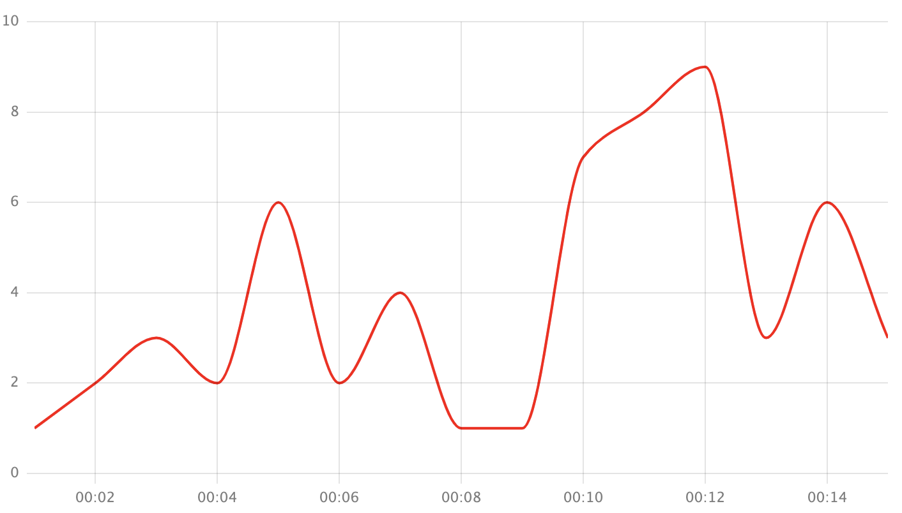

#### settings.drawOrder

Draw layers order: `'plotLines' | 'axes' | 'series'`.
By default: `['series', 'axes', 'plotLines']`, which means that axes will be over series, but under plotLines.

### uPlot

You can access uPlot instance via `yagr.uplot`.

#### config.editUplotOptions: (opts: Options) => Options;

This method allows to edit uPlot options after all Yagr transformations. It's useful in cases when you need extend Yagr's behavior or implement some new plugin.

### Localization

Yagr supports English (`'en'`) and Russian (`'ru'`) language. You can provide your own localization keys by `settings.locale`.

-   setup language: `settings.locale = 'en'`
-   provide keyset: `settings.locale = {'hide-all': 'Скрыть все линии', ... }`

#### Keyset

-   `hide-all` - Legend. Hide all lines button text.
-   `show-all` - Legend. Show all lines button text.
-   `sum` - Tooltip. Sum word at bottom of lines.
-   `scale` - Tooltip. Scale word at top of lines.

### Data alignment

Sometimes you have different data sources on different time grid. And when you point them on a single timeline there is data alignment artifacts appearing.

```
Source 1: [
    timestamps: [1, 20, 30],
    values:     [1, 1,  1],
]

Source 2: [
    timestamps: [0, 15, 30, 45],
    values:     [2, 2,  2,  2],
]
```

Produces:

```
{
    timeline: [0, 1, 15, 20, 30, 45],
    series: [{
        name: 'Source 1',
        data: [x, 1, x,  1,  1,  x]
    }, {
        name: 'Source 2',
        data: [2, x, 2,  x,  2,  2]
    }]
}
```

In this example we marked with `x` all artifacts. By default uPlot can handle such input if we replace `x` with undefined and set `spanGaps = true` in series options. But there are problems with stacked areas and columns. So Yagr has solution. If you have data alignment artifacts you can setup processing options:

```ts
timeline: [1, 2, 3],
series: [{
    name: 'Source',
    data: [1, 'x', 3],
}],
processing: {
    interpolation: {
        value: 'x',
        type: 'linear'
    }
}
```

Will produce chart where data `[1, 'x', 3]` will be rendered as `[1, 2, 3]` by linear interpolation type of initial value `'x'`.

### Processing

Data processing settings here.

#### nullValues: Record<string, null>

#### interpolation.value

Value in series data to be replaced with interpolation value.

#### interpolation.type

Type of interpolation. Examples are given for dataset:

```js
['x', 2, 'x', 'x', 4, 'x'];
```

-   `linear` - use simple linear interpolation between two points.

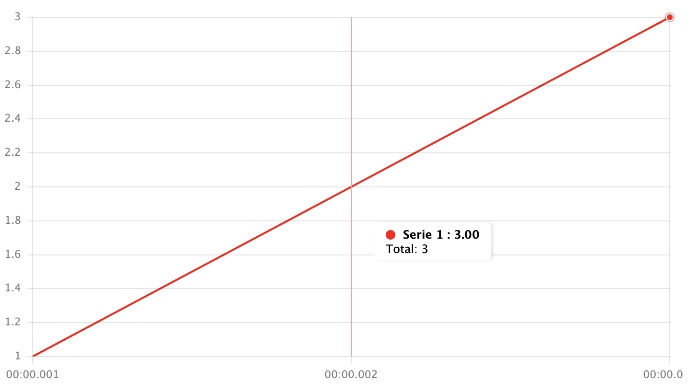

-   `left` - takes previous point's value if given point is not last one

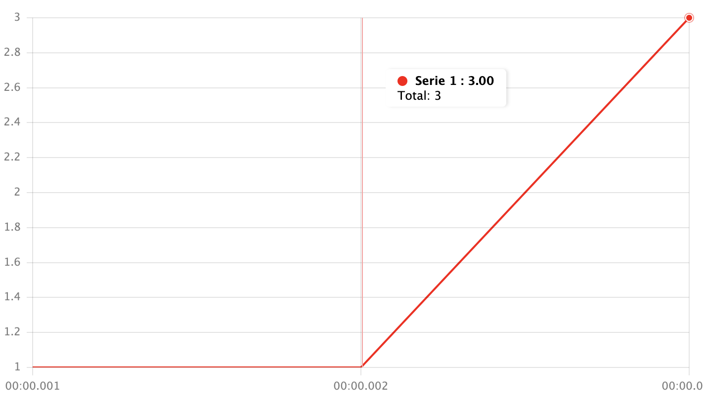

-   `previous` - takes previous point's value

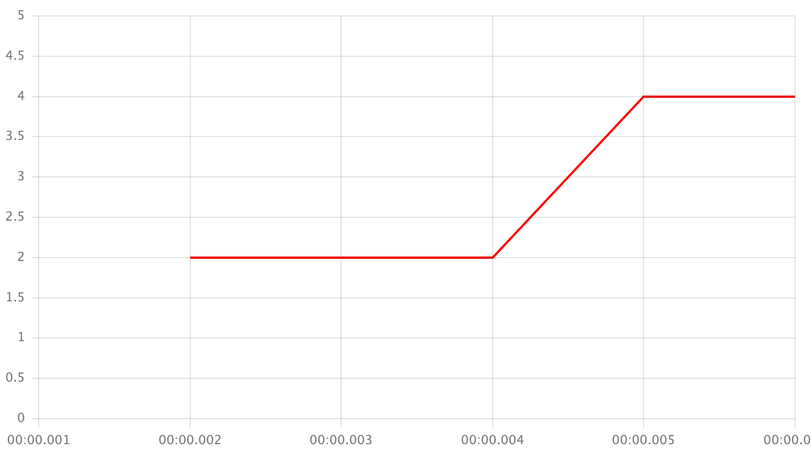

-   `right` - takes next point's value if given point is not first on

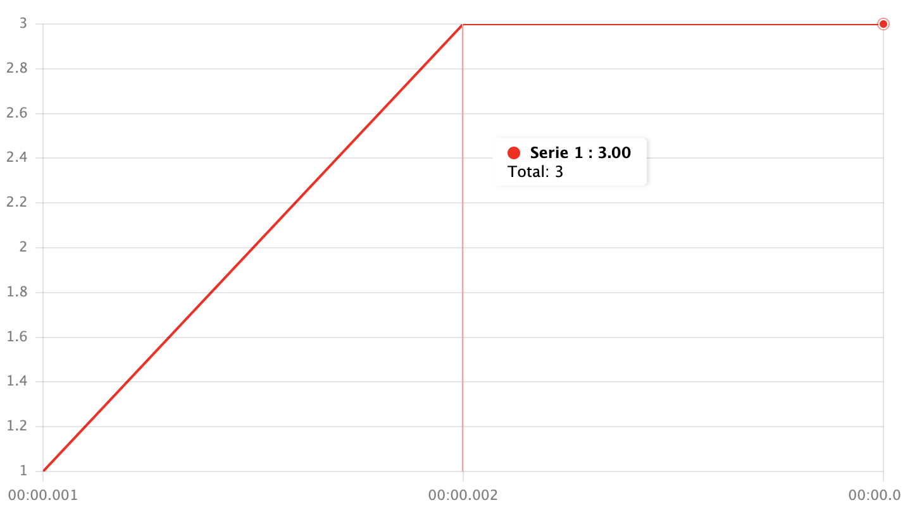

-   `next` - takes next point's value


-   `closest` - takes closest point's value

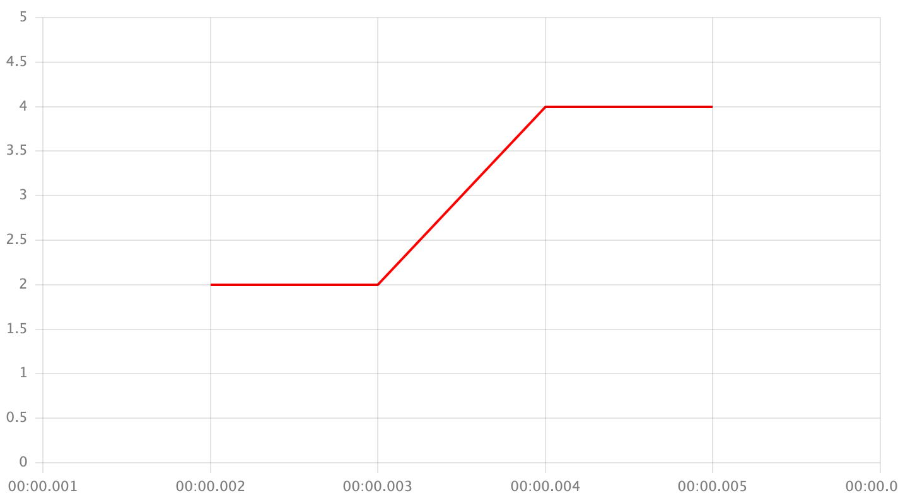

-   `<your value>` - replace value with yours

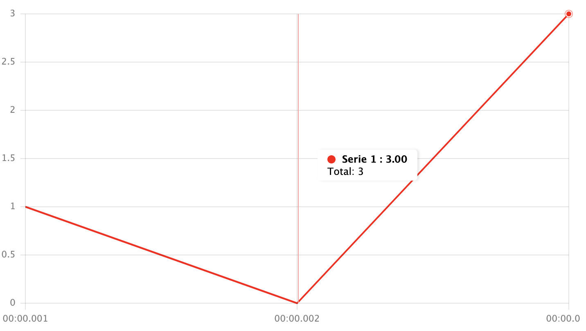

### CSS and named colors

Yagr supports CSS variables and CSS named color values (eg. `cyan`). One you should take an attention is that you CSS variable should be available to resolve in `yagr.root` HTML element:

```html
<div id="graph"></div>

<style>
    #graph {
        --custom-color: red;
    }
</style>
<script>
    new Yagr(window.graph, {
        timline: [1, 2, 3],
        series: [
            {
                data: [1, 2, 3],
                color: '--custom-color', // or var(--custom-color)
            },
        ],
    });
</script>
```
